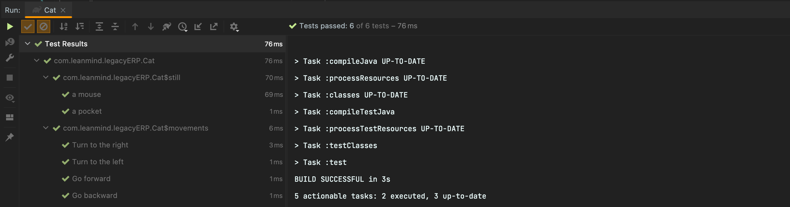

## Java Test

### General

- **_test** (Add new Java test with Assertj)

    ```java
    public class Cat {

            @Test
            @DisplayName("TODO: Rename this")
            public void todo_rename_this() {
                      
                fail("Not yet implemented");
            }
    }
    ```


### JUnit 5

- **_test_exception** (Add new Java exception test with JUnit5)

    ```java
    public class Cat {
  
         @Test
         @DisplayName("TODO: Rename this")
         public void todo_rename_this() {
             assertThrows(NumberFormatException.class, () -> {
                 fail("Not yet implemented");
             });
         }
    }
    ```

- **_test_value_object** (Add a battery of default test for value objects with JUnit5 and Assertj)

    ```java       
  public class Cat {                         
  
           @Test
           @DisplayName("Generate a cat")
           void generate_a_cat() {
       
               fail("Not yet implemented");
           }
       
           @Disabled
           @Test
           @DisplayName("Not allow empty values")
           void not_allow_empty_values() {
       
               assertThrows(RuntimeException.class, () -> {
                   // TODO add method
               });
           }
       
           @Disabled
           @Test
           @DisplayName("Not allow null values")
           void not_allow_null_values() {
       
               assertThrows(RuntimeException.class, () -> {
                   // TODO add method
               });
           }
  }

    ```

- **_test_enum** (Add a battery of default test for enum with JUnit5 and Assertj)

    ```java
    public class Cat {
  
      private final String VALUE_1 = "VALUE_1";
      private final String VALUE_2 = "VALUE_2";
      private final String INVALID_CAT  = "INVALID_CAT";
      
          @Test
          void only_be_created_with_a_valid_cat() {
              Assertions.assertNotNull(Cat.from(VALUE_1));
              Assertions.assertNotNull(Cat.from(VALUE_2));
          }
          
          @Disabled
          @Test
          void fail_when_cat_is_invalid() {
              assertThrows(InvalidCat.class, () -> Cat.from(INVALID_CAT));
          }
    }
    ```

- **_test_nested** (Group your test)
    ```java
   public class Cat {      
  
       @Nested
       @DisplayName("TODO: Rename this")
       class todoRenameThis {
       
               @Test
               @DisplayName("")
               public void subtest() {
                   //GIVEN
       
                   //WHEN
       
                   //THEN
                   assertThat().isEqualTo();
               }
           }
   }
    ```                                                
  
Example when you run the test using annotation `@Nested`


